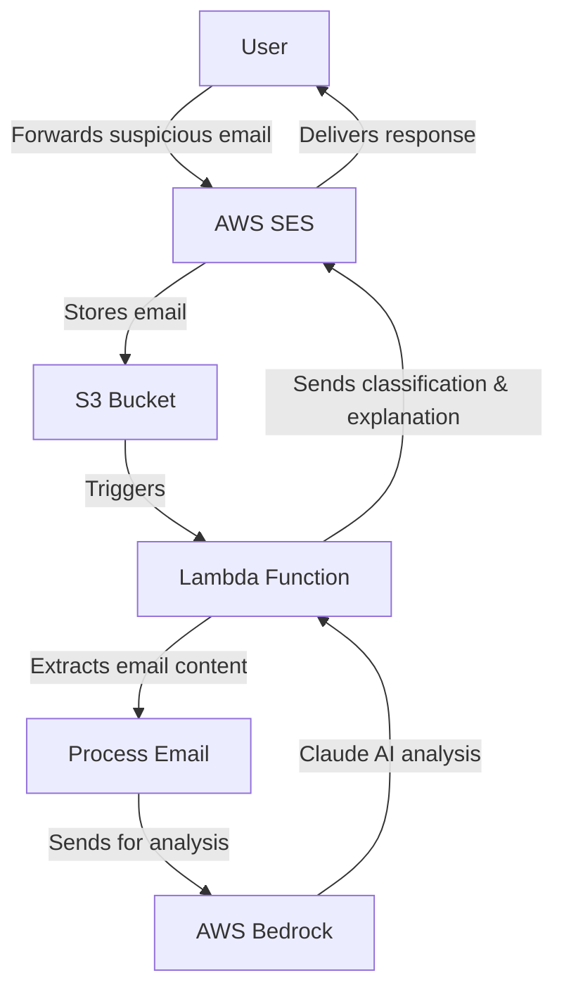

# AI Phishing Email Detection

A serverless AWS solution that uses Anthropic Claude AI to analyze forwarded emails and determine if they are phishing attempts or legitimate emails. The system provides detailed explanations to help users understand why an email was classified as phishing or clean, serving as an educational tool.

## Architecture



## Features

- **Email Forwarding**: Users can forward suspicious emails to a dedicated email address for analysis
- **AI-Powered Analysis**: Uses Anthropic Claude 3 Sonnet via AWS Bedrock to analyze emails
- **Detailed Explanations**: Provides educational feedback on why an email was classified as phishing or legitimate
- **Serverless Architecture**: Fully serverless implementation using AWS Lambda, S3, and SES
- **Infrastructure as Code**: Complete Terraform configuration for easy deployment

## Prerequisites

- AWS Account with appropriate permissions
- AWS CLI configured with admin access
- Terraform installed (v1.0.0+)
- Python 3.12+
- Access to AWS Bedrock with Claude models enabled
- You need to have a domain already setup and verified with AWS SES
- You need to have one email (ex: noreply@yourdomain) already added and verified with SES so that you can send notifications/replies. Ideally, you will have a *.@domain

## Setup and Deployment

### 1. Clone the repository

```bash
git clone https://github.com/yourusername/ai-phishing-email-detection.git
cd ai-phishing-email-detection
```

### 2. Configure AWS credentials for Bedrock

Create a `.env` file with your AWS credentials for Bedrock access:

```
AI_AWS_ACCESS_KEY_ID=your_access_key
AI_AWS_SECRET_ACCESS_KEY=your_secret_key
```

### 3. Deploy with Terraform

Initialize Terraform:

```bash
terraform init
```

Apply the configuration:

```bash
terraform apply -var-file="terraform.tfvars"
```

You'll need to create a `terraform.tfvars` file with the following variables:

```
ai_aws_access_key_id     = "your_access_key_id"
ai_aws_secret_access_key = "your_secret_access_key"
default_forwarder_catch_all = "your_catch_all_email@example.com"
```

Optional GitHub integration for catch-all emails:
```
github_token      = "your_github_token"
github_repo_owner = "your_github_username_or_org"
github_repo_name  = "your_repo_name"
```

### 4. Configure SES

Ensure that your SES service is properly configured:
- Verify the sender domain and email addresses
- Move out of the SES sandbox if needed
- Configure the receipt rule set to be active

## Environment Variables

The system uses the following environment variables:

| Variable | Description | Default | Required |
|----------|-------------|---------|----------|
| SES_DOMAIN_NAME | Domain name for SES | domain.tld | Yes |
| SES_EMAIL_SENDER | Email address to use as the sender | noreply@SES_DOMAIN_NAME | Yes |
| SES_PHISHING_EMAIL_RECEIVER | Email address to receive forwarded emails | phishing@SES_DOMAIN_NAME | Yes |
| SES_CONFIG_SET_NAME | SES Configuration Set Name | AWS-SES-Send-Email | Yes |
| DEFAULT_FORWARDER_CATCH_ALL | Catch-all email when forwarder can't be determined | - | Yes |
| GITHUB_TOKEN | GitHub token for creating issues | - | No |
| GITHUB_REPO_OWNER | GitHub repository owner | - | No |
| GITHUB_REPO_NAME | GitHub repository name | - | No |
| AI_AWS_ACCESS_KEY_ID | AWS access key ID for Bedrock API | - | Yes |
| AI_AWS_SECRET_ACCESS_KEY | AWS secret access key for Bedrock API | - | Yes |

## Usage

1. Users forward suspicious emails to the configured email address (default: `SES_PHISHING_EMAIL_RECEIVER`)
2. The system automatically processes the email and analyzes it with Claude AI
3. A response email is sent back to the user with the classification (PHISHING or CLEAN) and a detailed explanation
4. If an email is sent to the catch-all address, a GitHub issue will be created if GitHub integration is configured

## Local Testing

You can test the Lambda function locally using the included test script:

```bash
python test_lambda.py --bucket your-s3-bucket-name [--key specific-object-key]
```

If no specific object key is provided, the script will list available objects in the bucket and allow you to select one interactively.

## Project Structure

```
.
├── lambda_function.py     # Main Lambda function code
├── package.sh             # Script to package Lambda function for deployment
├── requirements.txt       # Python dependencies
├── terraform.tf           # Terraform configuration
├── test_lambda.py         # Local testing script
└── README.md              # This file
```

## Security Considerations

- The Lambda function uses environment variables for sensitive information
- IAM roles are configured with least privilege access
- S3 bucket is configured with private access
- SES is configured to handle emails securely

## Contributing

Contributions are welcome! Please feel free to submit a Pull Request.

## License

This project is licensed under the MIT License - see the LICENSE file for details.
