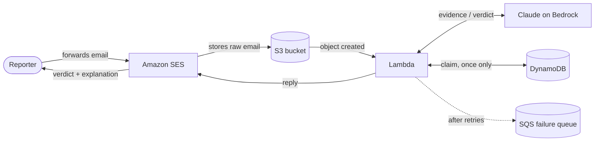

# AI Phishing Email Detection

<a href="LICENSE"></a>


Forward a suspicious email to one address and get a reply within a minute: a verdict (phishing,
suspicious, or likely safe) plus the specific red flags that led to it, so people learn to spot the
next one. It runs serverless on AWS with Claude on Amazon Bedrock by default, or with the Claude API, OpenAI,
or any compatible endpoint.

## Table of Contents

- [Overview](#overview)
- [Quick Install](#quick-install)
- [Features](#features)
- [Usage](#usage)
- [Architecture](#architecture)
- [Documentation](#documentation)
- [Contributing](#contributing)
- [License](#license)

## Overview

Security teams get a steady stream of "is this real?" emails. This project answers them
automatically. A user forwards the email to an address like `phishing@example.org`. The service
then pulls out the evidence that matters: sender and reply-to mismatches, SPF/DKIM/DMARC results,
where each link *really* points, and the attachments. Claude classifies the email, and the user gets
a clear, accessible reply that explains why.

It is built for organizations that already use Amazon SES. Replies go only to authenticated
forwarders in your domains, so the address can't be abused to send mail on your behalf.

## Quick Install

```bash
git clone https://github.com/ventz/ai-phishing-email-detection.git && cd ai-phishing-email-detection
uv sync && ./scripts/build.sh
cp terraform/terraform.tfvars.example terraform/terraform.tfvars   # edit: bucket, sender, receiver, domains
cd terraform && terraform init && terraform apply
```

Requires Python 3.13, [uv](https://docs.astral.sh/uv/), Terraform 1.5+, and an SES-verified domain
with receiving enabled. See [Getting Started](docs/getting-started.md) for SES setup, Bedrock model
access, and adopting an existing deployment.

## Features

- **Structured verdicts**: phishing / suspicious / likely safe, with a confidence level, concrete
  indicators, and "how to spot it" tips. The output is schema-validated, not parsed from free text.
- **Evidence the model can use**: parses forwards sent as attachments and inline forwards from
  Gmail and Outlook. It reads PDF text and links, decodes QR codes in images and PDFs, unwraps
  Proofpoint/Safe Links/Google redirects to the real destination, flags lookalike domains
  (`paypa1.com`, `chase.com-onlinebanking.com`), and uses the recipient's own Microsoft 365
  filter verdict when present. All offline: no attacker URL is ever fetched.
- **Resistant to prompt injection**: email content is fenced as untrusted data, and text that tries
  to steer the verdict counts against the email.
- **Safe by default**: deterministic guardrails stop "safe" when evidence is missing or a hard signal
  fires (malware, hidden instructions to AI scanners, unopenable attachments). A failed analysis
  never says "safe". Replies use a fixed subject and defang every link
  (`hxxps://evil[.]example`), and go only to DMARC-authenticated forwarders.
- **Accessible replies**: meet WCAG 2.2 AA contrast, work in dark mode, always include a
  plain-text part, and state the verdict first.
- **Hardened AWS setup**: no static keys, and the IAM policy is least-privilege. The S3 bucket is
  encrypted, TLS-only, and expires old emails. Duplicate replies are prevented, failed emails go to
  a queue with an alarm, and concurrency is capped.
- **Bring your own model**: Bedrock (IAM role, no keys), the Claude API, OpenAI, or any
  Anthropic- or OpenAI-compatible endpoint, with keys kept in Secrets Manager.
- **Operator CLI**: list stored emails, see exactly what the model sees, run an analysis locally,
  or replay an email through the deployed function.

## Usage

For users: forward a suspicious email to your phishing address. Forwarding it as an attachment
gives the best results, because it keeps the original headers. The reply arrives in about 10–20 seconds.

For operators:

```bash
export AWS_PROFILE=my-profile AWS_REGION=us-east-1 PHISHING_BUCKET=example-org-phishing-emails
uv run phishing-tools list                              # newest stored emails
uv run phishing-tools show --key <key>                  # evidence exactly as the model sees it
uv run phishing-tools analyze --key <key> --html r.html # classify locally; sends nothing
```

See [Operations](docs/operations.md) for replaying emails, the failure queue, and logs.

## Architecture


```mermaid
flowchart LR
    accTitle: Phishing report flow
    accDescr: A user forwards a suspicious email to the phishing address. Amazon SES stores it in S3, which triggers the Lambda function. Lambda checks the forwarder, extracts evidence from the email and its attachments, asks Claude on Amazon Bedrock for a verdict, applies deterministic guardrails, and emails the verdict back through SES. DynamoDB prevents duplicate replies and failed emails go to an SQS queue.
    User([Reporter]) -->|forwards email| SES[Amazon SES]
    SES -->|stores raw email| S3[(S3 bucket)]
    S3 -->|object created| Lambda[Lambda]
    Lambda <-->|evidence / verdict| Bedrock[Claude on Bedrock]
    Lambda <-->|claim, once only| DDB[(DynamoDB)]
    Lambda -.->|after retries| DLQ[(SQS failure queue)]
    Lambda -->|reply| SES
    SES -->|verdict + explanation| User
```

A user forwards an email to SES, which stores it in S3 and triggers the Lambda function. The
function checks who forwarded it, extracts the evidence (headers, links, PDFs, QR codes), asks
Claude on Bedrock for a verdict, applies deterministic guardrails, and replies through SES.
Details are in [Architecture](docs/architecture.md).

## Documentation

| Guide | What's in it |
|-------|--------------|
| [Getting Started](docs/getting-started.md) | SES and Bedrock prerequisites, first deploy, adopting an existing deployment |
| [Configuration](docs/configuration.md) | Every Terraform variable and environment variable |
| [Architecture](docs/architecture.md) | Request flow, security model, design decisions |
| [Operations](docs/operations.md) | CLI, logs, failure queue, replays, cost |
| [Security Policy](SECURITY.md) | Reporting vulnerabilities |

## Contributing

See [CONTRIBUTING.md](CONTRIBUTING.md) for development setup and tests.

## License

[MIT](LICENSE) © Ventz Petkov
