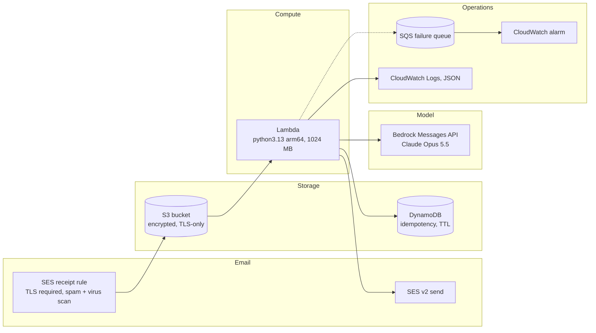
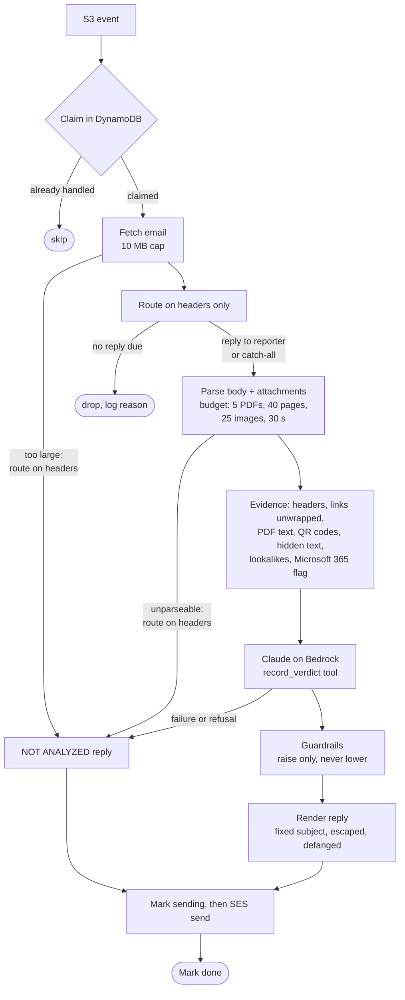
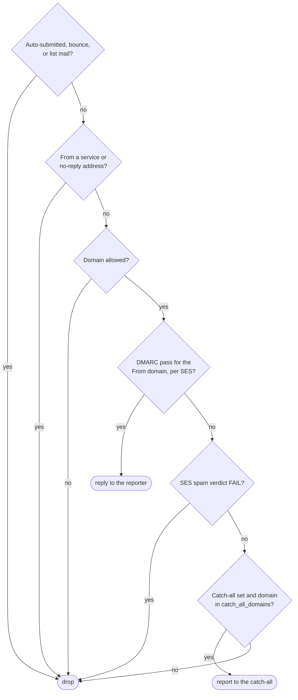

# Architecture

- [Components](#components)
- [Processing pipeline](#processing-pipeline)
- [Who gets a reply](#who-gets-a-reply)
- [Request flow](#request-flow)
- [Security model](#security-model)
- [Design decisions](#design-decisions)

## Components

## Processing pipeline

## Who gets a reply

## Request flow

1. **SES receives** mail for the phishing address. The receipt rule requires TLS, runs spam and
   virus scanning, and writes the raw message to S3. SES adds its own `Authentication-Results`
   (SPF/DKIM/DMARC for the *forwarder*) and `X-SES-*-Verdict` headers at the top.
2. **S3 triggers Lambda** asynchronously. The Lambda service retries twice, and anything that still
   fails lands in the SQS failure queue, which has an alarm.
3. **Idempotency.** The function claims `bucket/key` in DynamoDB, with a per-attempt token,
   before any side effect. S3 redeliveries and Lambda retries therefore never send a second reply.
   A retry that finds a *fresh* claim raises an error, so it backs off and eventually reaches the
   failure queue instead of being dropped silently. A claim older than the Lambda timeout is
   taken over.
4. **Parse** (`parsing.py`, pure). This step finds the forwarded original. An inline forward
   below a Gmail or Outlook marker or header block wins; otherwise it uses the first attached
   message. It extracts:
   - identity headers: From, Reply-To, Return-Path, DKIM signing domain, and the original's
     Authentication-Results;
   - links as (anchor text, real href) pairs, including form actions and meta refreshes;
   - attachments with their SHA-256 hashes, the text of HTML attachments, and PDF text, links and
     embedded images (`extractors.py`, pypdf);
   - QR codes decoded from attached or inline images and PDF images (zxing-cpp), added as links
     labeled `[QR code in …]`;
   - links unwrapped offline from Proofpoint URL Defense (v1–v3), Microsoft Safe Links and Google
     redirects to the real destination, and checked for lookalike brand domains (`urls.py`);
   - the recipient's Microsoft 365 *flag* (`X-Forefront-Antispam-Report`,
     `X-MS-Exchange-Organization-SCL`) on an attached original, read only when at most one of each
     header exists. "Not flagged" is never shown to the model: nearly every reported phish got past
     the filter, so it carries no information;
   - PDF active content (JavaScript, open actions, embedded files, launch/submit actions, XFA)
     marks the PDF uninspectable even when its text was read.

   Attachment reading runs under a per-email budget: at most 5 PDFs, 40 pages, 25 image decodes
   and 30 seconds, with pypdf's decompression limits lowered and Pillow restricted to PNG, JPEG,
   GIF, BMP and WebP. Anything left unread is recorded as omitted evidence. Routing runs on the
   headers alone *before* this step, so a sender we won't answer never gets an attachment opened.
   - the visible text from **every** inline HTML and plain part.

   Size is capped, and truncation is flagged to the model.
5. **Route** (`handler.route_reply`, pure). A reply goes to the forwarder only if:
   - there is exactly one From header, with one address;
   - it isn't a service or no-reply address;
   - its domain is in `allowed_sender_domains`;
   - SES recorded DMARC pass for that domain.

   SES's verdict is read only from the **first** `Authentication-Results` header, and only from a
   clause that *starts* with `dmarc=`. Comments and quoted strings are removed first, so an
   envelope sender like `dmarc=pass@attacker` cannot fake a pass.

   An authenticated reporter always gets the answer, even when SES flagged a virus (that verdict
   goes to the model). Unauthenticated reports from `catch_all_domains` go to the catch-all. Other
   domains, unauthenticated spam, bounces, auto-replies and mailing-list mail are dropped.
6. **Classify** (`classifier.py`). This step calls the Bedrock Messages API with a static system
   prompt (cached) and a `record_verdict` tool. The tool's input is validated against a Pydantic
   schema, and the model gets one re-prompt if it doesn't call the tool.
7. **Guardrails** (`guardrails.py`). Deterministic rules run after the model and can only raise the
   verdict. A virus verdict, hidden text addressed to AI scanners, or Microsoft 365 "high
   confidence phishing" means phishing. A Microsoft 365 phishing/spoof/spam verdict, a typosquat or
   embedded-brand domain (`paypa1.com`, `chase.com-onlinebanking.com`), a raw-IP or punycode link, a risky file type, an attachment we can't open (PDF, archive, Office), omitted
   evidence, or two different forwarded emails mean at least suspicious. A raised verdict lists
   the automated checks first.
8. **Render** (`render.py`, pure). The HTML and plain-text replies are built from the verdict. The
   subject is fixed (`Phishing report result: <VERDICT> (ref …)`) and never echoes the phish. The
   body names the reporter and time, escapes everything, defangs every URL and domain, removes
   phone numbers and masks third-party email addresses.
9. **Send** with SES v2, with `Auto-Submitted: auto-replied` and `In-Reply-To`/`References` set.
   Outlook and Apple Mail thread the reply under the reporter's forward; Gmail does not, because
   it also requires a matching subject, and the reply deliberately never repeats the phish's. A "sending" state is recorded first, so an
   ambiguous send is never repeated.

## Security model

| Threat | Control |
|--------|---------|
| Spoofed `From:` turns the service into a relay or backscatter source | DMARC-pass gate on SES's own verdict (the topmost header only), domain allowlist, and an IAM `ses:FromAddress` condition |
| A phish talks the model into "clean" | Evidence is fenced as untrusted data, and steering text counts as a phishing signal. A decoy text/plain part is surfaced next to the HTML. The verdict comes from a schema, not keyword matching |
| Attacker controls what the model sees (unclosed `<head>`, hidden forward markers, decoy parts) | Only script/style/template suppress text; hidden text is captured and labeled, never dropped; markers are read from visible text only; an attached original wins and inline text is kept as secondary evidence |
| Evidence silently dropped by size caps | Every cap is recorded and shown to the model, and a guardrail forbids "safe" |
| Reply used as a lure or tripping content filters | Fixed subject `Phishing report result: <VERDICT> (ref …)`, never the phish's subject; the body states who reported it and when; "safe" summaries are templated; phone numbers removed and third-party addresses masked |
| Failures reported as "clean" | Any classification failure sends **NOT ANALYZED — treat as suspicious** |
| Model output injects links or HTML into the reply | Everything is HTML-escaped. URLs and domains, including internationalized (IDN) domains, are defanged, and bidirectional and zero-width characters are stripped |
| Restricted (TLP:AMBER / RED) reports outlive their audience | Still analyzed and answered. The raw email is tagged before any reply is sent, and a lifecycle rule removes tagged objects within one to two days, so cleanup survives crashes and failed sends; the function role cannot delete from the bucket. The catch-all gets only a content-free notice. Hidden text is ignored when reading the label, so a phish can't use one to hide. TLP:GREEN and CLEAR are handled normally. Bedrock invocation logging is off; the bucket has no versioning, replication or backup copies |
| Catch-all GitHub issues leak personal data | Issues carry metadata only: verdict, reason, S3 key, sender and link domains, attachment hashes |
| Long-lived credentials | No static keys: the Lambda role, or an optional assumed role. The GitHub token lives in Secrets Manager and never enters Terraform state |
| Stored emails contain personal data and live payloads | Bucket is private, owner-enforced, SSE, and TLS-only; the SES write is scoped by `SourceArn`; lifecycle expiry. Logs record keys and verdicts, never content |
| Floods and cost | A domain allowlist is required by default. Reserved concurrency, a 10 MiB size cap, body truncation, prompt caching, and model timeouts that respect the Lambda deadline |
| Supply chain | Locked dependencies installed with `--require-hashes`; providers pinned with a lock file |
| Mail loops | `Auto-Submitted` in both directions, and the service never replies to itself |

## Design decisions

- **Bedrock Messages API via the Anthropic SDK (`AnthropicBedrockMantle`)** rather than
  `InvokeModel` or Converse. It is the same request surface as the Claude API, SigV4-signed with the
  Lambda role. On Bedrock, `strict` tools and `output_config.format` currently return 400, and
  Opus/Sonnet 5.5 reject forced `tool_choice`. That is why the verdict uses `tool_choice: auto`
  plus validation and a re-prompt.
- **Offline enrichment only.** URLs are unwrapped and checked locally; nothing is fetched, which would
  tip off the attacker and burn one-time links. PDF parsing uses pypdf (BSD) rather than PyMuPDF
  (AGPL); vector-drawn QR codes inside PDFs are therefore not decoded, embedded QR images are.
- **No `temperature`.** Sampling parameters return 400 on the current models, so variance is
  controlled by the schema and by effort.
- **S3 trigger kept** (rather than a direct SES Lambda action). SES's verdict headers in the stored
  message carry the same authentication information, and the existing deployment keeps working
  unchanged.
- **Handler shim.** `lambda_function.lambda_handler` re-exports `phishing_detector.handler`, so
  existing function configurations keep working.
